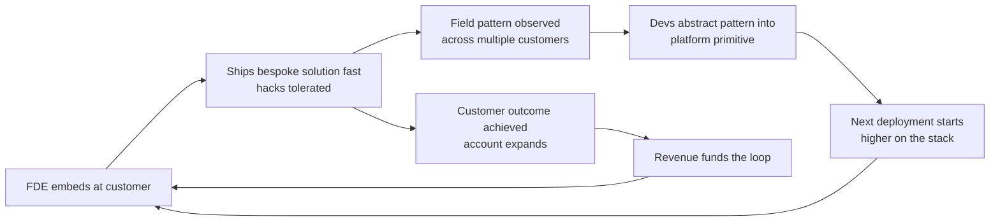

# The Productization Flywheel — How Bespoke Work Becomes a Platform

The economic heart of the FDE model. Without this flywheel, forward deployment is just expensive
consulting; with it, every engagement is R&D that pays twice.

## The mechanism

1. **FDEs solve the specific problem, not the general one.** At Airbus, Qureshi's team built
   "Asana, but for building planes" — work orders + missing parts + quality issues + schedules in
   one interface. No attempt at generality on site.
2. **Patterns emerge across customers.** When the third and fifth customer need the same shape of
   thing (data ingestion, object modeling, app scaffolding), that's a platform signal.
3. **Product Development abstracts it.** Field hacks become Foundry primitives
   ([ontology-first](./ontology-first.md) has the table). "Every engagement was, functionally,
   an R&D investment that paid in operational insight."
4. **Deployment cost per customer declines as the platform matures.** Each new engagement starts
   higher on the stack, so FDE time shifts from plumbing to outcomes — which is also what lets
   3–5-day AIP bootcamps replace months-long pilots.

## The numbers that prove it worked

- By 2024, **Foundry generated over 50% of Palantir's revenue at ~80% gross margins** —
  software economics, versus ~32% at Accenture (consulting economics). (Per Qureshi.)
- Palantir 2024 revenue: **$2.87B**; top-20 customers alone ~$1.1B/year.
- **1,000+ AIP bootcamps** run by end-2024, converting "at a high rate into seven-figure contracts."
- U.S. commercial revenue grew ~137% YoY by Q4 2025 on the bootcamp motion.

## What makes the flywheel spin (and stall)

| Spins | Stalls |
|---|---|
| Devs explicitly tasked with mining deployments for patterns | Field work disconnected from product org |
| FDEs rotate back toward product (become users before builders) | FDE org treated as a separate consultancy |
| Refusing one-off systems-integration work | Accepting any billable work ([the consulting trap](../02-mental-models/the-consulting-trap.md)) |
| Patient capital — Thiel funded years of apparent non-progress | Demanding consulting-style margins from day one |

The structural vulnerability Qureshi flags: the model needed a rich, patient backer willing to fund
years where the flywheel looked like pure cost. Replicating that patience is the hard part.

## Further reading

- [Dev vs Delta](./dev-vs-delta.md) — the org split that powers the loop
- [The consulting trap](../02-mental-models/the-consulting-trap.md) — the failure mode
