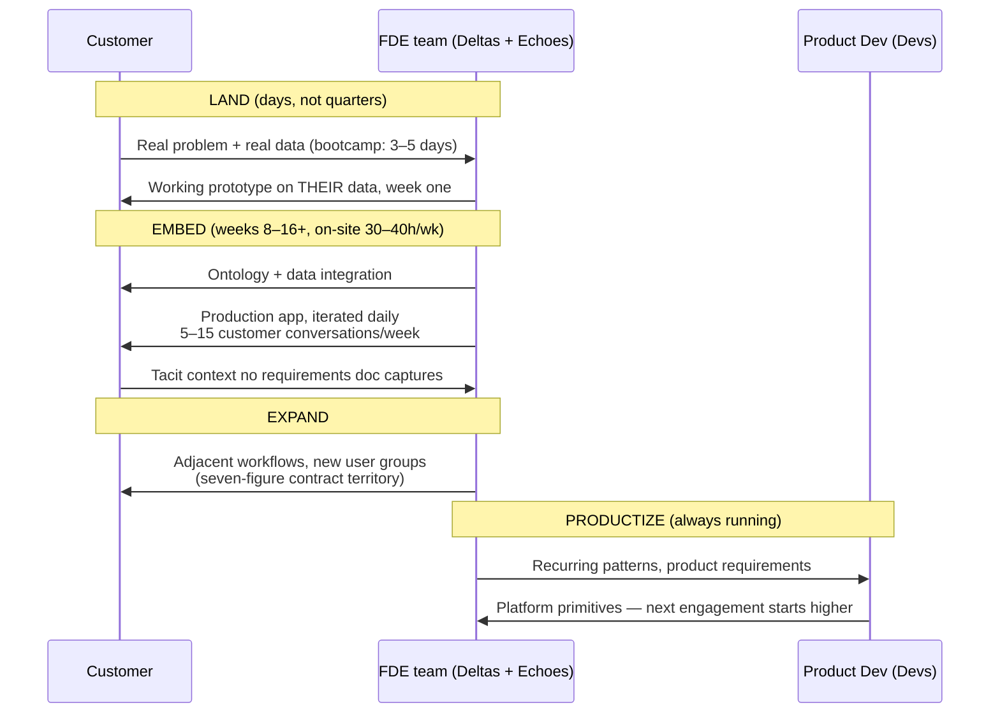

# The Engagement Lifecycle — Bootcamp to Platform

How a single customer engagement runs, from first contact to compounding account.

## Phase by phase

### 1. Land — prove value before the contract does

The modern entry point is the **AIP bootcamp**: a 3–5 day intensive where FDEs build a working
prototype on the customer's own data. Palantir disclosed **1,000+ bootcamps by end-2024**,
converting at a high rate into seven-figure contracts. The principle: hands-on proof beats a
roadmap deck for overcoming institutional skepticism, and compresses time-to-value from the
industry-standard ~90-day discovery into days.

### 2. Embed — the core FDE motion

8–16 week engagements (AI-lab variant) or open-ended residencies (classic Palantir: 3–4 days/week
on-site, sometimes for a year+). The team is small (4–5 people), ships daily, and treats customer
discovery as engineering work. The first real deliverable is almost always
[data integration + ontology](../01-core-concepts/ontology-first.md).

### 3. Expand — deployment is the go-to-market

Because FDEs sit in Business Development, there is no sales/delivery handoff. The working software
is the sales motion: adjacent workflows, new departments, bigger scope. Hiring guidance from the
playbook: **~1 FDE per $2–5M of enterprise pipeline**. Top-20 Palantir customers alone came to
generate ~$1.1B/year.

### 4. Productize — the phase that isn't a phase

Runs continuously in the background: FDE feedback routes directly into product, and recurring
patterns become platform ([the flywheel](../01-core-concepts/productization-flywheel.md)). This
is also the phase imitators forget first — see
[the consulting trap](./the-consulting-trap.md).

## Political reality check

Qureshi's warning: expect institutional politics to consume most of a pilot period — data
gatekeepers, workflow owners, careers at stake — leaving only the final weeks for the demo.
Budgeting for this is the [Echo's](../01-core-concepts/delta-echo-pairing.md) whole job.
