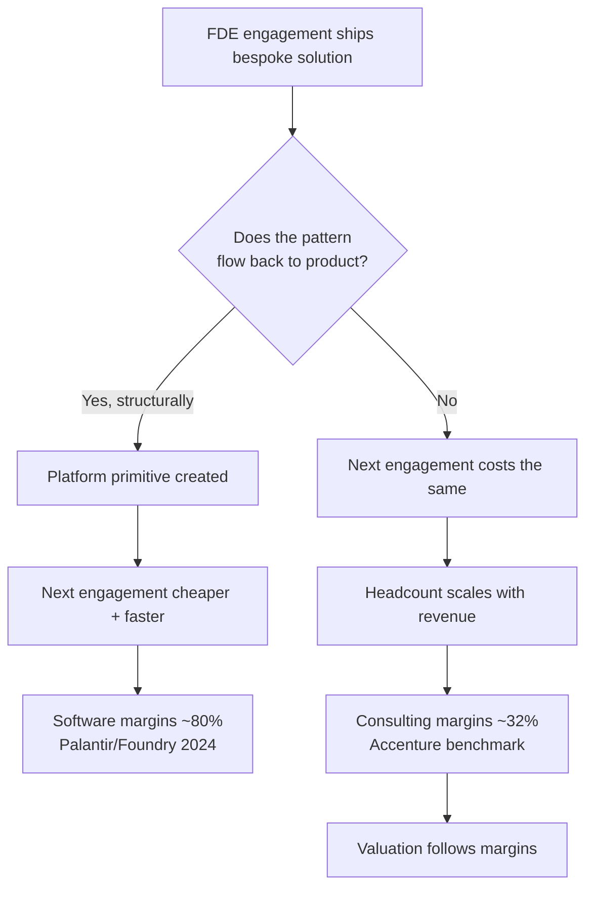

# The Consulting Trap — The Model's One Fatal Failure Mode

> "The whole thing is a trap that's dangerously easy to turn into a low-margin consulting firm."
> — Bob McGrew (early Palantir executive, later OpenAI Chief Research Officer)

The FDE model and a consulting firm look identical from the outside for the first two years:
engineers at customer sites, bespoke deliverables, revenue tied to engagements. The difference is
entirely in what compounds.

## How the slide happens (gradually, then suddenly)

1. **Any billable work gets accepted.** Systems integration, staff augmentation, "just this one
   custom thing" — each individually reasonable, each adding zero platform value.
2. **FDE utilization becomes the KPI.** Once you measure billable hours, you've built a
   consultancy; outcome ownership quietly dies.
3. **Product stops mining deployments.** The Dev side treats field reports as noise; patterns
   recur at customer after customer without being abstracted.
4. **Pricing follows time-and-materials.** The moment you price inputs instead of outcomes,
   customers manage you like a vendor, and margins converge to consulting.

## The guardrails (from the Palantir playbook)

- **Refuse systems-integration work.** The customer owns their application; you own the
  generalizable patterns. This is an explicit principle in the playbook AI labs copied.
- **Price outcomes, not time.** The theaiopportunities analysis notes startups reaching
  eight-figure revenue in a year *because* they priced customer outcomes, not T&M rates.
- **Make productization someone's job.** The [flywheel](../01-core-concepts/productization-flywheel.md)
  needs Devs explicitly tasked with abstracting field patterns, and FDE feedback routed directly
  into product management.
- **The no-incumbent test (McGrew).** Deploy the model where no established competitor already
  has embedded teams — the margin runway comes from being first to the context, not from out-billing
  Accenture.
- **Patient capital.** Palantir needed Thiel-grade patience through years when the flywheel looked
  like pure cost. If your investors need consulting-style revenue efficiency now, the trap is
  already sprung.

## The honest counterpoint

Sometimes the "trap" is a fine business: high-touch deployment services for AI are in demand and
profitable. The trap is only fatal if you *think* you're building a software company while
structurally building a consultancy — the margins, valuation multiple, and hiring profile all
follow the structure, not the story.
