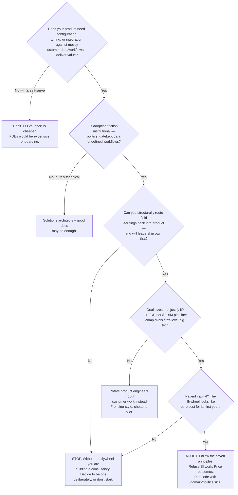

# Should You Hire FDEs?

A decision tree for whether the forward-deployed model fits your company, distilled from when the
sources say it works vs fails.

## The four gates, in words

1. **Complexity gate.** The model only pays when value delivery genuinely requires engineering in
   the customer's environment — AI systems post-deployment, defense/government, data-heavy
   enterprise. If users can self-serve, FDEs are overkill.
2. **Flywheel gate.** The single non-negotiable. If recurring field patterns have no structural
   path into product ([flywheel](../01-core-concepts/productization-flywheel.md)), every
   engagement costs the same forever and you've built Accenture with worse margins — see
   [the consulting trap](../02-mental-models/the-consulting-trap.md).
3. **Economics gate.** FDEs are expensive (staff-level comp, 99% rejection funnels, travel) and
   scale with accounts. The pipeline heuristic (~$2–5M per FDE) is the sanity check.
4. **Patience gate.** Productization lags deployment by years. Palantir had Thiel; what do you have?

## Cheap ways to test before committing

- **Run a bootcamp motion first.** 3–5 days, customer's real data, working prototype — measures
  both your team's field fitness and the market's pull, without standing up an org.
- **Pilot a rotation.** Send 2–3 product engineers into your gnarliest account with a mentor,
  Frontline-style, and see what comes back: shipped outcomes and product insights, or misery.
- **Audit one deal.** Take your last stuck enterprise deal and ask: would an embedded engineer
  pair have unstuck it? If the blocker was price or product gaps, FDEs fix nothing.
